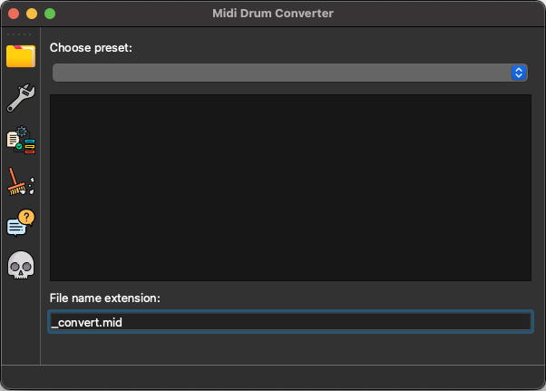
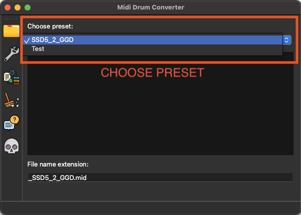

# MidiDrumConverterQt
Simple midi drum converter build w. Qt5/C++

Description:

When using different drum vst plugins, you have the problem that these plugins are not using the same notes.
For example: The note for Kick is mostly on 36. Otherwise Kontakt/GetGoodDrums plays Kick on 24.
 
When you are using a Midi Drum Library, you can use it just for a specific plugin, or you have to drag every instrument where it should be.

The smarter solution is a midi drum converter.
You have to config a presets.xml file once, and then you can convert the midi library from one plugin to another.

Maybe there is also an alternative way in DAWs, but I liked the idea to convert the files.
The converter is not limited to drum files. You could transpose piano files, or whatever you would like to. 

The presets.xml file:

The MDC uses an standard xml-file to convert the notes.
Here you can add notes or whole presets, if you want to.
Take care about the brackets!

